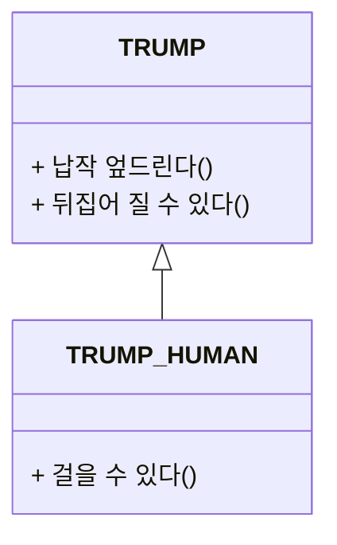

# 타입과 추상화 
## 목차

[1. 추상화를 통한 복잡성 극복](#1-추상화를-통합-복잡성-극복)  
[2. 객체지향과 추상화 ](#2-객체지향과-추상화)  
* [2-1. 개념](#21-개념)  
* [2-2. 개념의 세가지 관점](#22-개념의-세가지-관점)  
* [2-3. 객채룰 분류하기 위한 틀](#23-객체를-분류하기-위한-틀)  
* [2-4. 분류는 추상화를 위한 도구다](#24-분류는-추상화를-위한-도구)

[3. 타입](#3-타입)   
* [3-1. 타입은 개념이다](#31-타입은-개념이다)   
* [3-2. 데이터 타입](#32-데이터-타입) 
* [3-3. 객체와 타입](#33-객체와-타입)   
* [3-4. 행동이 우선이다](#34-행동이-우선이다)

[4. 타입의 계층 ](#4-타입의-계층)
* [4-1. 트럼프 계층](#41-트럼프-계층)
* [4-2. 일반화 특수화 관계](#42-일반화와-특수화-관계)
* [4-3. 슈퍼타입 서브타입](#43-슈터타입과-서브-타입)
* [4-4. 일반화는 추상화를 위한 도구](#44-일반화는-추상화를-위한-도구이다)

[5. 정적 모델](#5-정적타입)   
* [5-1. 타입의 목적](#51-타입의-목적)
* [5-2. 결국 타입은 추상화다](#52-결국-타입은-추상화다)
* [5-3. 동적 모델과 정적 모델](#53-동적-모델과-정적-모델)
* [5-4. 클래스](#54-클래스)

지하철을 이용하는 승객의 목적은 하나의 역에서 다른 역으로 이동하는 것이다. 지하철 노선도 디자인에서 가장 중요한 것은 얼마나 사실적으로 지형을 묘사했느냐가 아니라 역과 역 사이 연결성을 얼마나 직관적으로 표현 했는가이다. 지하철 노선도의 핵심은 지도가 당연히 가져야 하는 정확성을 버리고 목적에 집중했다는 것이다.  
> 어떤 역에서 출발해야 하는가?  
> 어떤 역에서 환승해야 하는가?  
> 어떤 역을 거쳐야 가장 빠르고 쉽게 목적지에 도착하는가? 

## 1. 추상화를 통합 복잡성 극복
- 추상화란 현실에서 출발하되 불필요한 부분을 도려내가면서 사물의 놀라운 본질을 드러나게 하는 과정이라고 할 수 있다. 
- 추상화의 목적은 불필요한 부분을 무시함으로써 현실에 존재하는 복잡성을 극복하는 것이다.
- 어떤 추상화도 의도된 목적이 아닌 다른 목적으로 사용된다면 오도될 수 있다. **추상화의 수준, 이익, 가치는 목적에 의존적이다.**
- **추상화의 정의**는 어떤 양상, 세부 사항, 구조를 좀 더 명확하게 이해하기 위해 특정 절차나 물체를 의도적으로 생략, 감춤으로써 복잡도를 극복하는 방법이다.
- 복잡성을 다루기 위한 추상화는 아래와 같이 두 차원에서 이루어진다.        

    > 사물들 간의 공통점은 취하고 차이점은 버리는 일반화를 통해 단순화하게 만드는 것이다.     
    > 중요한 부분을 강조하기 위해 불필요한 세부 사항은 제거한다. 

*** 
## 2. 객체지향과 추상화 
- 앨리스에 나오는 왕, 왕비, 경비병등은 트럼프로 추상화 할 수 있다.
- 인물들의 계급, 나이, 성격 등의 차이점은 무시하고 **트럼프라는 유사성**을 기반으로 추상화해서 보고 있다. 트럼프와 토끼라는 그룹으로 나누어 단순화한다. 

### 2.1 개념
- 객체지향 패러다임의 중심에는 구체적이고 실제적인 객체가 존재하지만 수많은 객체들을 개별적인 단위로 취급하기에는 인간이 지닌 인지 능력은 턱없이 부족하다.
- 공통적인 특성을 기준으로 객체를 여러 그룹으로 묶어서 동시에 다뤄야 하는 가짓수를 줄이고 상황을 단순화 한다.
- 공통점을 기반으로 객체들을 묶기 위한 그릇을 **개념(Concept)이라고 한다.**
- 개념을 이용하면 객체를 여러 그룹으로 분류하는 것이 가능하다 (토끼와 트럼프)
- 각 객체는 특정한 개념을 표현하는 그룹의 일원으로 포함된다.
    > 하트 여왕 - 트럼프  
    > 하얀 토끼 - 토끼
- 그 객체에 어떤 개념을 적용하는 것이 가능해서 개념 그룹의 일원이 될 때 객체를 그 개념의 Instance라고 한다.

### 2.2 개념의 세가지 관점
- 심볼 : 개념을 가리키는 간략한 이름 혹은 명칭
    - 트럼프 
- 내연 : 개념의 의미 
    - 몸이 납작하고 두 손 두 발이 네모난 몸 모서리에 달려있다. 
    - 내연은 개념을 객체에 적용할 수 있는지 여부를 판단하기 위한 조건이다. 
    - 토끼는 내연을 만족시킬 수 없기 때문에 트럼프가 될 수 없다. 
- 외연 : 개념에 속하는 객체들로 개념의 인스트턴스들이 모여 이뤄진 집합이다. 

### 2.3 객체를 분류하기 위한 틀
- 외연의 관점에서 어떤 객체에 어떤 개념을 적용할 수 있다는 것은 동일한 개념으로 구성된 객체 집합에 해당 객체를 포함 시킨다는 것을 의미한다.
- 어떤 객체를 마주했을 때 객체에게 적용할 개념을 결정하는 것은 결국 해당 객체를 개념이 적용된 객체 집합의 일원으로 맞아들인다는 것을 의미한다.
- 분류란 특정한 객체를 특정한 개념의 객체 집합에 포함 시키거나 포함 시키지 않는 작업을 의미한다.
- 객체를 적절한 개념에 따라 분류한 애플리케이션은 유지보수가 용이하고 변경에 유연하게 대처할 수 있다. 

### 2.4 분류는 추상화를 위한 도구
- 추상화는 두 가지 차원에서 이루어진다.
- 첫 번째 차원 
    - 구체적인 사물 간의 차이점은 버리고 공통점을 취한다.
    - 일반화를 통해 단순화 한다. 
- 두번째 차원
    - 중요한 부분을 강조하기 위해 불필요한 세부 사항을 제거해 단순화 한다.
- 개념은 객체들의 복잡성을 극복하기 위한 추상화 도구이다.

## 3. 타입 
### 3.1 타입은 개념이다. 
- 개념이라는 것을 컴퓨터 공학자들이 표현한 것을 수학으로 차용해 왔다. 바로 타입이다.
- 타입의 정의는 개념의 정의와 완전히 동일하며 타입은 공통점을 기반으로 객체들을 묶기 위한 틀이다.
- 타입에 속하는 객체 역시 타입의 인스턴스이다.

### 3.2 데이터 타입
- 메모리 세상 속에는 타입이라는 질서가 존재하지 않고, 타입이 없는 체계 안에서 모든 데이터는 일련의 비트열로 구성된다.
- 타입 없는 무질서가 초래한 혼도의 세상을 질려버린 사람들이 메모리 안에 데이터에 특정한 의미를 부여하기 시작했다.  
- 데이터를 목적에 따라 분류하기 시작하면서 프로그래밍 언어 안에는 서서히 타입 시스템이 자라나기 시작했다. 타입시스템의 목적은 메모리 안의 모든 데이터가 비트열로 보임으로써 야기되는 혼란을 방지하는 것이다.
- 데이터 타입은 메모리 안에 저장된 데이터의 종류를 분류하는 데 사용하는 메모리 집합에 관한 메타데이터다. 데이터에 대한 분류는 암시적으로 어떤 종류의 연산이 해당 데이터에 대해 수행될 수 있는지를 결정한다.

### 3.3 객체와 타입 
- 객체지향 프로그램을 작성할 때 우리는 객체를 일종의 데이터 처럼 사용한다.
- 객체를 타입에 따라 분류하고 그 타입에 이름을 붙이는 것은 프로그램에서 사용할 새로운 데이터 타입을 선언하는 것과 같다.
- 객체는 데이터가 아니다. 객체에서 중요한 것은 객체의 행동이다. 상태는 행동의 결과로 초래된 부수효과를 쉽게 표현하기 위해 도입한 추상적인 개념이다.
- 어떤 객체가 어떤 타입에 속하는지를 결정하는 것은 객체가 수행하는 행동이다 따라서 어떤 객체들이 동일한 행동을 수행할 수 있다면 그 객체들은 동일한 타입으로 분류된다.
- 객체의 내부적인 표현은 외부로 부터 철저하게 감춰진다. 객체의 행동을 가장 효과적으로 수행할 수 있다면 객체 내부의 상태를 어떤 방식으로 표현하더라도 무방하다.

### 3.4 행동이 우선이다. 
- 객체가 어떤 행동을 하느냐에 따라 객체의 타입이 결정되므로 객체의 타입은 객체 내부 표현과는 아무런 상관이 없다.
- 객체의 내부 표현 방식이 다르더라도 **어떤 객체들이 동일하게 행동한다면 객체들은 동일한 타입**에 속한다.
- 같은 타입에 속한 객체들은 행동만 동일하면 서로 다른 데이터를 가질 수 있다. 행동이 동일 하다는 것은 동일한 책임의 의미하고 동일한 책임이란 동일한 메시지의 수신을 의미한다.
- 동일한 타입에 속한 객체는 내부 표현 방식이 달라도 동일한 메시지를 수신하고 이를 처리할 수 있다 다만 내부의 표현 방식이 다르기 때문에 메시지를 처리하는 방식이 서로 다를 수 밖에 없다. 여기서 **다형성에 의미를 부여한다.**
- 행동에 따라 객체를 분류하기 위해서 객체가 내부적으로 관리해야 하는 데이터가 아니라 객체가 외부에 제공해야 하는 행동을 생각해야 한다.
- 객체가 외부에 제공해야 하는 책임을 결정한다. 그 책임을 수행하는데 적합한 데이터를 나중에 결정하고 데이터의 책임을 수행하는데 필요한 외부 인터페이스 뒤로 캡슐화 해야 한다.
***
## 4. 타입의 계층 
### 4.1 트럼프 계층
> 트럼프 인간의 외양은 트럼프와 유사하지만 행동 자체는 트럼프와 동일하지 않다.  
> 트럼프 인간은 트럼프가 할 수 있는 것을 하지만 트럼프 보다 조금 더 특화 된 행동을 할 수 있다.  
> 트럼프 인간은 트럼프다, 트럼프 인간은 동시에 트럼프다.  
> 트럼프 인간 타입에 속한 객체는 트럼프 타입의 객체에도 함께 속해야 한다.  
- 트럼프는 트럼프 인간을 포괄하는 좀 더 일반적인 개념이다. 
- 트럼프 인간은 트럼프보다 조금 더 특화된 행동을 하는데 이 두 개념 사이를 일반화와 특수화라고 한다.

### 4.2 일반화와 특수화 관계
- 집합의 개념에서 본다면 특수한 개념인 트럼프 인간이 좀 더 일반적인 개념을 표현 하는 트럼프의 부분 집합이 된다.
- 객체의 일반화 특수한 관계는 결정하는 것은 객체의 상태가 아니라 행동이다.
- 타입의 내연을 의미하는 행동의 가짓수와 외연을 의미하는 집합은 서로 반대다.

### 4.3 슈터타입과 서브 타입
- 일반 타입을 슈퍼타입 특수 타입을 서브 타입이라고 한다.
- 어떤 타입이 다른 타입의 서브 타입이 되기 위해서는 행위적 호환성을 만족시켜야 한다. 
- 서브타입은 슈퍼타입의 행위와 호환되기 때문에 서브 타입은 슈퍼타입을 대체할 수 있어야 한다.

### 4.4 일반화는 추상화를 위한 도구이다.
- 일반화 /특수화 계층은 객체지향 패러다임에서 추상화와 두번째 차원을 적절하게 활용하는 대표적인 예이다.

*** 
## 5. 정적타입 
### 5.1 타입의 목적
- 타입을 사용하지 않으면 인간의 인지 능력으로는 동적으로 변하는 객체의 복잡성을 극복하기 어렵다.

### 5.2 결국 타입은 추상화다.
- 어떤 시점에 앨리스에 관해 생각할 때 불필요한 시간이라는 요소와 상태 변화라는 요소를 제거 하고 철저하게 정적인 관점의 앨리스 모습을 묘사하는 것이 가능하다.

### 5.3 동적 모델과 정적 모델
- 우리는 객체를 생각할 때 두 가지 모습을 고려한다. 
- 첫째 객체가 특정 시점에 구체적으로 어떤 값을 가지는가? 객체지향 모델링에서 스냅샷은 객체 다이어 그램이라고 불린다. 스냅샷처럼 **<U>객체가 살아 움직이는 동안에 상태가 변하고 어떻게 행동하는지는 포착하는 것을 동적 모델**</U>이라고 한다.
- 둘째 객체가 가질수 있는 모든 상태와 행동을 시간에 독립적으로 표현하는 것이다. 이것은 타입 모델이라고 하며 이 모델은 **<U>동적으로 변하는 객체의 상태가 아니라 객체가 속한 타입의 정적인 모습을 표현하기 때문에 정적 모델**</U>이라 한다.
- 객체지향 애플리케이션을 설계하고 구현하기 위해서는 객체 관점의 동적 모델과 객체를 추상화한 정적 모델을 적절히 혼용해야 한다.
- 객체지향 프로그래밍 언어를 이용해 클래스를 작성하는 시점에는 시스템을 정적인 관점에서 접근하는 것 이다. 그러나 실제로 애플리케이션을 실행해 객체의 상태 변경을 추적하고 디버깅하는 동안에는 객체의 동적인 모델을 탐험하고 있는 것이다. 

### 5.4 클래스
- 객체지향 프로그래밍 언어에서 정적인 모델은 클래스를 이용해 구현한다. 타입을 구현하는 것은 가장 보편적인 방법은 클래스다. 클래스와 타입은 동일하지 않으며. 타입은 객체를 분류하기 위해서 사용하는 것이다.
- 클래스와 타입을 구분하는 것은 설계를 유연하게 유지하기 위한 바탕이 된다.
> 조영호, 『객체지향의 사실과 오해』, 위키북스(2015)  
