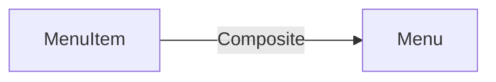
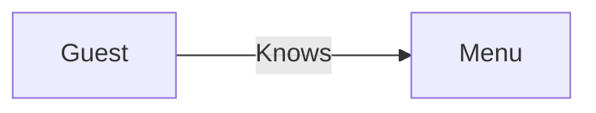
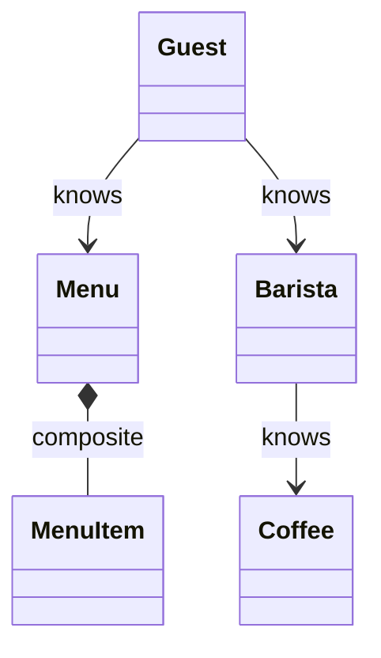
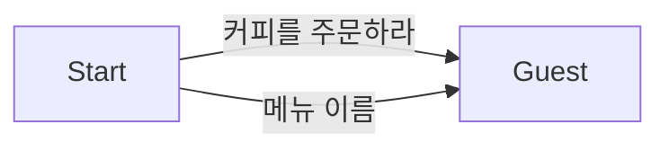
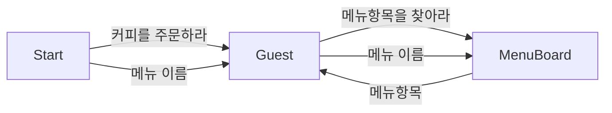
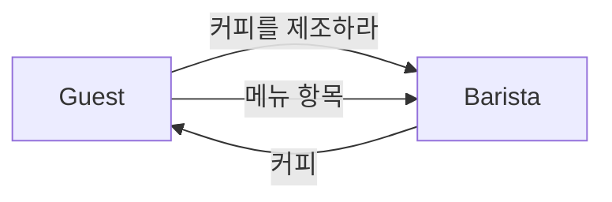
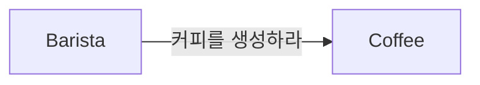
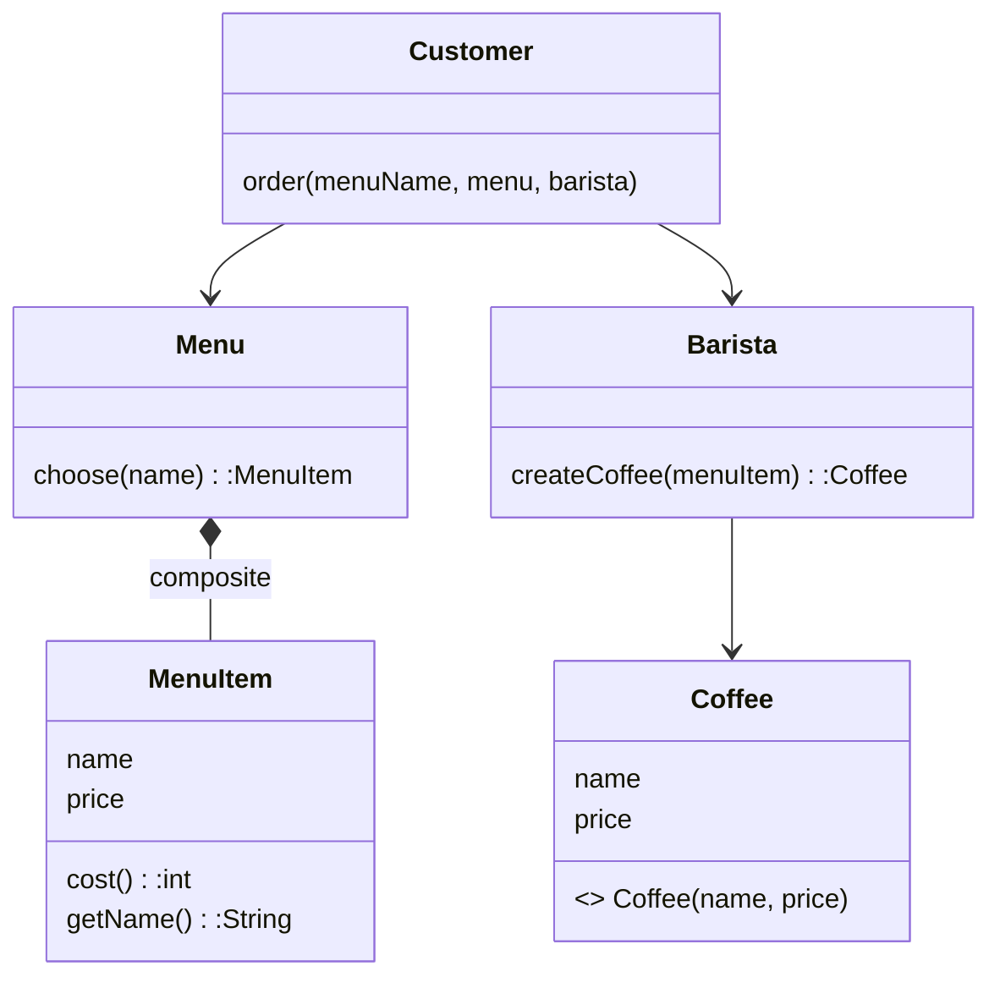

# 함께 모으기 
## 목차
[1. 커피 전문점 도메인](#1-커피-전문점-도메인)  
[2. 설계하고 구현하기](#2-설계하고-구현하기)  
[3. 코드와 세가지 관점](#3-코드와-세가지-관점)   
***
## 1. 커피 전문점 도메인  
- 손님 객체
- 메뉴판 객체
- 메뉴 항목 객체
- 바리스타 객체
- 커피 객체 

## 2. 설계하고 구현하기  
### 2.1 커피를 주문하기 위한 협력 찾기 
#### 포함 관계 또는 합성 관계

#### 연관 관계

####  전체 관계 

- 협력을 설계할 때에는 객체가 메시지를 선택하는 것이 아니라 메시지가 객체를 선택하게 해야 한다.
- 메시지를 수신할 객체는 메시지를 처리할 책임, 객첵가 수신하는 메시지는 객체가 외부에 제공하는 공용 인터페이스에 포함된다.

#### 커피를 주문하라 

#### 메뉴항목을 찾아라  

#### 커피를 제조하라 

#### 커피를 생성하라 

### 2.2 인터페이스 정리하기 
- 각 객체를가 수신한 메시지가 객체의 인터페이스를 결정한다.
- 각 객체를 협력이라는 문맥에서 떼어내면 수신 가능한 메시지만 추려내면 인터페이스가 된다.
- 객체의 인터페이스 안에는 메시지에 해당하는 오퍼레이션이 존재한다는 것을 의미한다.
### 2.3 구현하기 

***
## 3. 코드와 세가지 관점   
### 3.1 코드는 세가지 관점을 모두 제공해야 한다 
#### 개념 관점
- 커피 전문점 도메인을 구성하는 중요한 개념과 관계를 반영한다.
- 소프트웨어 클래스와 도메인 클래스 사이의 간격이 좁으면 좁을 수록 기능을 변경 하기 위해 뒤적거려야 할 코드 양이 줄어든다.
#### 명세 관점

- 명세관점은 클래스의 인터페이스를 바라본다. 클래스의 public 메서드는 다른 클래스가 협력할 수 있는 공용 인터페이스를 드러낸다.
- 공용 인터페이스는 외부 객체가 유일하게 접근 가능한 부분이다.
- 변화에 안정적인 인터페이스를 만들기 위해서는 인터페이스를 통해 구현 및 세부 사항이 드러나지 않아야 한다.
#### 구현 관점
- 클래스와 메서드의 속성은 구현에 속하며 공용 인터페이스의 일부가 아니다.
- 메서드의 구현 및 속성의 변경은 원칙적으로 외부 객체에게 영향을 미쳐선 안된다.
- 메서드 및 속성이 클래스 내부로 캡슐화 되어야 한다.

### 3.2 도메인 개념을 참조하는 이유 
- 메시지를 수신할 객체를 선택하는 방법은 도메인 개념 중에서 가장 적절한 것을 선택하는 것이다.
- 소프트웨어 클래스가 도메인 개념을 따르면 변화에 쉽게 대응이 가능하다.
- 소프트웨어는 항상 변하기 때문에 설계는 변경을 위해서 존재한다. 
- 여러 개의 클래스로 기능을 분할 하고 클래스 안에서 인터페이스와 구현을 분리하는 것은 변경이 발생했을 때 더 수월하게 수정하길 원하기 때문이다.

### 3.3 인터페이스와 구현을 분리하라 
- 명세 관점에서는 안정적인 측면이 드러나야 한다.
- 구현 관점에서는 클래스의 블안정한 측면이 드러난야 한다.
- 마틴 파울러는 개념적인 관점과 명세 관점 사이는 중요하지 않지만 명세와 구현을 분리하는 것은 매우 중요하다고 주장한다. 
***
> 조영호, 『객체지향의 사실과 오해』, 위키북스(2015)  
